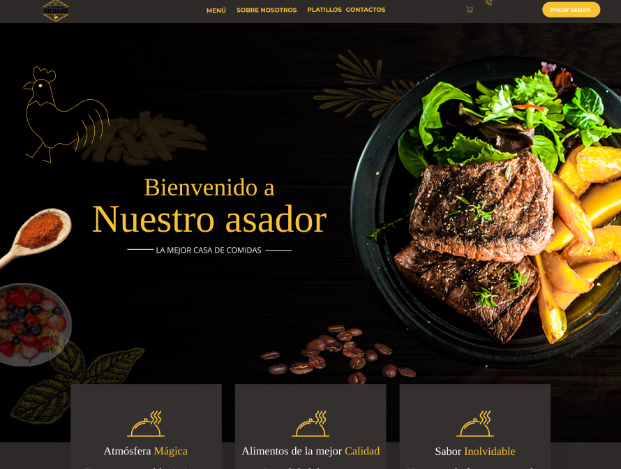

<!-- Improved compatibility of back to top link: See: https://github.com/othneildrew/Best-README-Template/pull/73 -->

<!-- PROJECT LOGO -->
<br />
<div align="center">
  <a href="https://www.elasadorderichard.live/">
    
  </a>

  <h3 name="readme-top" align="center">El-Asador-De-Richard</h3>
  <p align="center">
    Este es un proyecto de final de semestre, donde se demostraran las habilidades aprendidas. También se presenta la solución al algunas problemáticas que se presentaron el día de la toma de información.
    <br />
    <a href="https://github.com/"><strong>Explora los documentos »</strong></a>
    <br />
    <br />
    <a href="https://www.elasadorderichard.live/">Ver Demo</a>
    ·
    <a href="https://github.com/ICCOCUT/Asador-de-Richard/issues">Reportar Bug</a>
  </p>
</div>

<!-- TABLE OF CONTENTS -->
<details>
  <summary>Table de Contenidos</summary>
  <ol>
    <li>
      <a href="#acerca-del-proyecto">Acerca del Proyecto</a>
      <ul>
        <li><a href="#construido-con">Construido Con</a></li>
      </ul>
    </li>
    <li>
      <a href="#cómo-empezar">Cómo Empezar</a>
      <ul>
        <li><a href="#prerrequisitos">Prerrequisitos</a></li>
        <li><a href="#instalación">Instalación</a></li>
      </ul>
    </li>
    <li><a href="#uso">Uso</a></li>
    <li><a href="#roadmap">Roadmap</a></li>
    <li><a href="#contribución">Contribución</a></li>
    <li><a href="#licencia">Licencia</a></li>
    <li><a href="#contacto">Contacto</a></li>
    <li><a href="#agradecimientos">Agradecimientos</a></li>
  </ol>
</details>

<!-- ABOUT THE PROJECT -->

## Acerca del Proyecto

Un sistema de punto de venta (POS, por sus siglas en inglés) es un programa que se utiliza para registrar las transacciones en una tienda o comercio. En el caso de una pollería, un sistema POS puede ayudar a llevar un control eficiente de las ventas, los inventarios y los pagos.

Este proyecto en GitHub presenta un sistema de punto de venta específico para una pollería. Con él, los usuarios pueden registrar fácilmente las ventas de pollo y otras comidas, mantener un control de los inventarios y procesar los pagos de manera rápida y segura. Además, el sistema puede generar informes y estadísticas para ayudar a la toma de decisiones.

El código fuente para este proyecto está disponible en GitHub, lo que significa que puede ser descargado, modificado y utilizado de manera gratuita. También se anima a los usuarios a contribuir con el proyecto, ya sea a través de la presentación de problemas o la creación de solicitudes de extracción.

En resumen, este proyecto de GitHub ofrece una solución eficiente y de código abierto para un punto de venta de pollería que ayudará a mejorar los procesos de ventas y administración de un negocio.

<p align="right">(<a href="#readme-top">Regresar al inicio</a>)</p>

### Construido Con

En esta sección se enumerar los principales frameworks/bibliotecas utilizados para arrancar el proyecto. Dejo los complementos/plugins para la sección de agradecimientos.

- [![Next][next.js]][next-url]
- [![React][react.js]][react-url]
- [![Tailwind.css][tailwind.css]][tailwind.css]

<p align="right">(<a href="#readme-top">Regresar al inicio</a>)</p>

<!-- GETTING STARTED -->

## Cómo Empezar

Para poner en marcha una copia local siga estos sencillos pasos de ejemplo..

### Prerrequisitos

Este es un ejemplo de cómo hacer una lista de las cosas que necesitas para utilizar el software y cómo instalarlas.

- npm
  ```sh
  npm install npm@latest -g
  ```

### Instalación

_A continuación se muestra un ejemplo de cómo purde instalar y configurar la aplicación. Por el momento esta no tiene dependencias externas._

1. Clona el repositorio
   ```sh
   git clone https://github.com/ICCOCUT/Asador-de-Richard.git
   ```
2. Instala los paquetes NPM
   ```sh
   npm install
   ```
3. Corre el proyecto
   ```sh
   npm run dev
   ```

<p align="right">(<a href="#readme-top">Regresar al inicio</a>)</p>

<!-- USAGE EXAMPLES -->

## Uso

Utilice este espacio para mostrar ejemplos útiles de cómo se puede utilizar un proyecto. Las capturas de pantalla adicionales, los ejemplos de código y las demos funcionan bien en este espacio. También puede enlazar a más recursos.

_Para más ejemplos, revisa la [Documentation](https://example.com)_

<p align="right">(<a href="#readme-top">Regresar al inicio</a>)</p>

<!-- ROADMAP -->

## Roadmap

- [x] Agregar El footer
- [ ] Terminar la landing page
- [ ] Terminar el diseño de la aplicación
- [ ] Terminar las demás rutas
  - [ ] Terminar la ruta de menú
  - [ ] Terminar la ruta de about
  - [ ] Terminar la ruta de platillos
  - [ ] Terminar la ruta de contacto
- [ ] Terminar el sistema de login
- [ ] Terminar la base de datos
- [ ] Terminar el sistema de pedidos
- [ ] Agregar sistema de pago

<p align="right">(<a href="#readme-top">Regresar al inicio</a>)</p>

<!-- CONTRIBUTING -->

## Contribución

Contributions are what make the open source community such an amazing place to learn, inspire, and create. Any contributions you make are **greatly appreciated**.

If you have a suggestion that would make this better, please fork the repo and create a pull request. You can also simply open an issue with the tag "enhancement".
Don't forget to give the project a star! Thanks again!

1. Fork the Project
2. Create your Feature Branch (`git checkout -b feature/AmazingFeature`)
3. Commit your Changes (`git commit -m 'Add some AmazingFeature'`)
4. Push to the Branch (`git push origin feature/AmazingFeature`)
5. Open a Pull Request

<p align="right">(<a href="#readme-top">Regresar al inicio</a>)</p>

<!-- LICENSE -->

## Licencia

Distribuido bajo la Licencia MIT. Consulte `LICENSE.txt` para más información.

<p align="right">(<a href="#readme-top">Regresar al inicio</a>)</p>

<!-- CONTACT -->

## Contacto

Your Name - [@your_twitter](https://twitter.com/your_username) - email@example.com

<p align="right">(<a href="#readme-top">Regresar al inicio</a>)</p>

<!-- ACKNOWLEDGMENTS -->

## Agradecimientos

Use this space to list resources you find helpful and would like to give credit to. I've included a few of my favorites to kick things off!

- [Choose an Open Source License](https://choosealicense.com)
- [Img Shields](https://shields.io)
- [GitHub Pages](https://pages.github.com)
- [Font Awesome](https://fontawesome.com)
- [React Icons](https://react-icons.github.io/react-icons/search)

<p align="right">(<a href="#readme-top">Regresar al inicio</a>)</p>

<!-- MARKDOWN LINKS & IMAGES -->
<!-- https://www.markdownguide.org/basic-syntax/#reference-style-links -->

[next.js]: https://img.shields.io/badge/next.js-000000?style=for-the-badge&logo=nextdotjs&logoColor=white
[next-url]: https://nextjs.org/
[react.js]: https://img.shields.io/badge/React-20232A?style=for-the-badge&logo=react&logoColor=61DAFB
[react-url]: https://reactjs.org/
[tailwind.css]: https://img.shields.io/badge/Tailwindcss-20232A?style=for-the-badge&logo=TailwindCSS&logoColor=#06B6D4
[tailwind.css]: https://tailwindcss.com/
